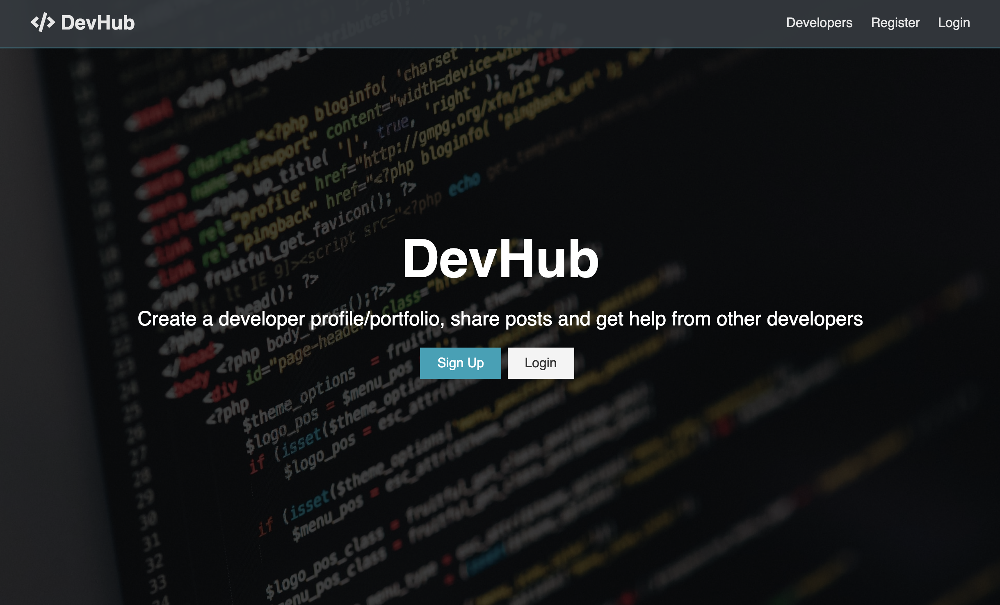

# [DevHub](https://protected-dusk-01067.herokuapp.com/)

Social network app for developers including authentication, profiles and forum posts.



This project was built following the excellent **MERN Stack Front To Back: Full Stack React, Redux & Node.js** [Udemy Course](https://www.udemy.com/course/mern-stack-front-to-back/) by Brad Traversy.

## Features

* Full stack social network app with React, Redux, Node, and Express. **MongoDB replaced with PostgreSQL**
* Backend API with Express
* Stateless JWT authentication practices
* React integrated with Express
* React Hooks, Async/Await & modern practices
* Redux for state management
* Deployed to Heroku with a postbuild script

### Install server dependencies

```bash
npm install
```

### Install client dependencies

```bash
cd client
npm install
```

### Run both Express & React from root

```bash
npm run dev
```

### Build for production

```bash
cd client
npm run build
```

### Test production before deploy

After running a build in the client 👆, cd into the root of the project.  
And run...

```bash
NODE_ENV=production node server.js
```

Check in browser on [http://localhost:5000/](http://localhost:5000/)
